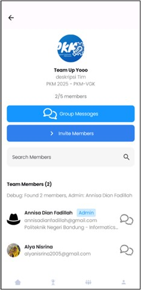
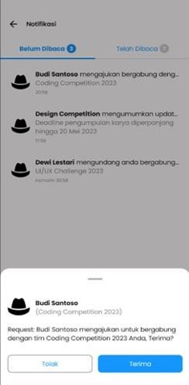

# TeamUp - Platform Kolaborasi Mahasiswa 🎓 - 2025

[](https://dgip.go.id/)
[](https://kotlinlang.org/)
[](https://developer.android.com/jetpack/compose)
[](https://firebase.google.com/)

> **TeamUp** adalah aplikasi mobile berbasis Android yang dirancang khusus untuk membantu mahasiswa Indonesia dalam mengelola prestasi akademik, membentuk tim lomba, dan menemukan kompetisi yang sesuai dengan minat dan keahlian mereka.

**Aplikasi ini telah terdaftar dan dilindungi oleh Hak Kekayaan Intelektual (HAKI).**

---

## 📱 Tentang TeamUp

TeamUp hadir sebagai solusi bagi mahasiswa yang ingin:
- Membangun portofolio prestasi yang terstruktur dan profesional
- Menemukan rekan tim dengan skill dan minat yang sesuai
- Mengakses informasi kompetisi terkini dari berbagai bidang

### 🎯 Tujuan Aplikasi

1. **Memfasilitasi Kolaborasi** - Menghubungkan mahasiswa dengan minat dan keahlian yang sama untuk membentuk tim kompetisi yang solid
2. **Manajemen Prestasi** - Menyediakan platform untuk mendokumentasikan dan menampilkan prestasi akademik dan non-akademik
3. **Akses Informasi Kompetisi** - Menjadi pusat informasi berbagai kompetisi dan lomba mahasiswa
4. **Networking** - Membangun jejaring profesional sejak dini melalui kolaborasi tim

---

## ✨ Fitur Unggulan

### 1. 🎨 Manajemen Profil & Portofolio
- Profil lengkap dengan foto, bio, dan informasi akademik
- Dokumentasi prestasi, pengalaman, dan aktivitas
- Manajemen keahlian dengan tingkat kemahiran (Beginner - Expert)

<p align="center">
  
  
</p>

### 2. 👥 Pencarian & Pembentukan Tim
- Buat tim lomba dengan deskripsi dan kategori yang jelas
- Filter pencarian anggota berdasarkan universitas, jurusan, dan keahlian
- Sistem undangan dan permintaan bergabung yang terstruktur
- Chat grup real-time untuk koordinasi tim

<p align="center">
  
  
</p>

### 3. 🏆 Manajemen Kompetisi
- Browse kompetisi dari berbagai kategori (IT, Bisnis, Desain, Sains, dll)
- Filter berdasarkan status dan cabang lomba
- Detail lengkap kompetisi dengan timeline dan persyaratan
- Download file panduan dan lampiran kompetisi
- Buat dan kelola kompetisi sendiri

<p align="center">
  
  
</p>

### 4. 🔔 Sistem Notifikasi Cerdas
- Notifikasi undangan tim
- Pengingat deadline kompetisi

<p align="center">
  
</p>

### 5. 🏠 Dashboard Interaktif
- Carousel banner kompetisi
- Quick access menu ke fitur utama
- Kompetisi trending berdasarkan popularitas

<p align="center">
  
</p>

---

## 👩‍💻 Tim Pengembang

Aplikasi TeamUp dikembangkan oleh:

- **Alya Nisrina** - Developer
- **Annisa Dian Fadillah** - Developer
- **Rindi Indriani** - Developer

---

## 🛠️ Teknologi yang Digunakan

### Frontend
- **Kotlin** - Bahasa pemrograman utama
- **Jetpack Compose** - Modern UI toolkit untuk Android

### Backend & Database
- **Firebase Authentication** - Manajemen user dan autentikasi
- **Firebase Firestore** - Database NoSQL real-time

### Media Management
- **Google Drive API** - Penyimpanan dan manajemen gambar/media

### Architecture
- **MVVM Pattern** - Clean architecture
- **Dependency Injection** - Modular dan testable code

---

## 📋 Persyaratan Sistem

### Untuk Pengguna
- Android 7.0 (Nougat) atau lebih tinggi
- Koneksi internet aktif
- Ruang penyimpanan minimal 100MB
- Akun email yang valid

### Untuk Developer
- Android Studio Hedgehog (2023.1.1) atau lebih baru
- JDK 11 atau lebih tinggi
- Gradle 8.0+
- Kotlin 1.9+

---

## 🚀 Panduan Instalasi untuk Developer

### 1. Clone Repository

```bash
git clone [https://github.com/AnnisaDianFadillah06/teamUP.git]
cd teamUP
```

### 2. Setup Firebase

1. Buka [Firebase Console](https://console.firebase.google.com/)
2. Buat project baru atau gunakan project yang sudah ada
3. Tambahkan aplikasi Android dengan package name: `com.example.teamup`
4. Download file `google-services.json`
5. Letakkan file tersebut di folder `app/`

**Aktifkan layanan Firebase berikut:**
- Authentication (Email/Password)
- Cloud Firestore
- Firebase Storage
- Cloud Messaging

### 3. Setup Google Drive API

1. Buka [Google Cloud Console](https://console.cloud.google.com/)
2. Buat project baru atau pilih project Firebase yang sama
3. Aktifkan Google Drive API
4. Buat credentials (OAuth 2.0 Client ID)
5. Download file `credentials.json`
6. Tambahkan konfigurasi ke file `local.properties`:

```properties
GOOGLE_DRIVE_CLIENT_ID=your_client_id_here
GOOGLE_DRIVE_CLIENT_SECRET=your_client_secret_here
```

### 4. Buka Project di Android Studio

1. Buka Android Studio
2. Pilih **File → Open**
3. Navigate ke folder project yang sudah di-clone
4. Tunggu hingga Gradle sync selesai

### 5. Sync dan Build Project

```bash
# Di terminal Android Studio atau di root project
./gradlew clean
./gradlew build
```

Atau gunakan menu Android Studio:
- **Build → Clean Project**
- **Build → Rebuild Project**

### 6. Run Aplikasi

**Opsi 1: Menggunakan Emulator**
1. Buat Android Virtual Device (AVD) melalui AVD Manager
2. Pilih device dengan API Level 24 atau lebih tinggi
3. Klik tombol **Run** (▶️) di toolbar

**Opsi 2: Menggunakan Device Fisik**
1. Aktifkan **Developer Options** di perangkat Android
2. Aktifkan **USB Debugging**
3. Hubungkan perangkat ke komputer via USB
4. Pilih device di Android Studio
5. Klik tombol **Run** (▶️)

### 7. Build APK

Untuk membuat APK yang dapat diinstall:

```bash
# Debug APK
./gradlew assembleDebug

# Release APK (memerlukan signing config)
./gradlew assembleRelease
```

APK akan tersimpan di:
- Debug: `app/build/outputs/apk/debug/app-debug.apk`
- Release: `app/build/outputs/apk/release/app-release.apk`

---

## 📂 Struktur Project

```
teamup/
├── app/
│   ├── src/
│   │   ├── main/
│   │   │   ├── java/com/example/teamup/
│   │   │   │   ├── common/           # Shared utilities
│   │   │   │   ├── data/             # Data layer
│   │   │   │   │   ├── model/        # Data models
│   │   │   │   │   ├── repositories/ # Repository pattern
│   │   │   │   │   └── sources/      # Data sources
│   │   │   │   ├── di/               # Dependency Injection
│   │   │   │   ├── presentation/     # UI Layer
│   │   │   │   │   ├── components/   # Reusable UI components
│   │   │   │   │   ├── screen/       # App screens
│   │   │   │   │   └── viewmodels/   # ViewModels
│   │   │   │   └── MainActivity.kt
│   │   │   ├── res/                  # Resources
│   │   │   └── AndroidManifest.xml
│   │   └── test/                     # Unit tests
│   ├── build.gradle.kts
│   └── google-services.json          # Firebase config (tidak di-commit)
├── gradle/
├── build.gradle.kts
├── settings.gradle.kts
├── local.properties                  # Local config (tidak di-commit)
└── README.md
```

---

## 🔐 Keamanan & Privacy

- Semua data user terenkripsi di Firebase
- Autentikasi email dengan verifikasi wajib
- Password di-hash sebelum disimpan
- Google Drive API untuk secure media storage
- Hanya anggota tim yang dapat mengakses chat grup

---

## 📚 Panduan Penggunaan

Untuk panduan lengkap penggunaan aplikasi, silakan baca dokumen [Manual Guide TeamUp](https://github.com/AnnisaDianFadillah06/teamUP/blob/main/DOKUMENTASI_KMIPN_2025/MANUAL_GUIDE_CIPTAINOVASI_KMIPN2025_TEAM%20UP_POLITEKNIK%20NEGERI%20BANDUNG.pdf).

### Quick Start untuk Pengguna:

1. **Registrasi** - Buat akun dengan email dan verifikasi
2. **Lengkapi Profil** - Upload foto dan isi data profil
3. **Tambahkan Keahlian** - Input skill dan tingkat kemahiran
4. **Explore Kompetisi** - Browse dan filter kompetisi yang tersedia
5. **Buat/Join Tim** - Bentuk tim baru atau bergabung dengan tim existing
6. **Berkolaborasi** - Gunakan chat grup untuk koordinasi tim

<p align="center">
  
  
  
</p>

---

## 🔄 Update & Roadmap

### Fitur yang Akan Datang:
- ✨ Study Buddy Group
- ✨ Sistem rating dan review rekan/peer
- ✨ Analytics untuk tracking progress prestasi
- ✨ AI-powered team matching
- ✨ Integrasi dengan LinkedIn
- ✨ Export portfolio ke PDF

---

## 🐛 Known Issues & Troubleshooting

### Gradle Sync Failed
```bash
# Clean dan rebuild
./gradlew clean
./gradlew build --refresh-dependencies
```

### Firebase Connection Error
- Pastikan file `google-services.json` ada di folder `app/`
- Cek koneksi internet
- Verifikasi package name sesuai dengan Firebase console

### Google Drive API Error
- Cek kredensial di `local.properties`
- Pastikan Drive API sudah aktif di Google Cloud Console
- Verifikasi OAuth consent screen sudah dikonfigurasi

---

## 📄 Lisensi

Aplikasi ini dilindungi oleh **Hak Kekayaan Intelektual (HAKI)**.  
© 2025 TeamUp Development Team. All rights reserved.

Penggunaan, modifikasi, dan distribusi aplikasi ini harus mendapatkan izin tertulis dari tim pengembang.

---

## 📞 Kontak & Support

Untuk pertanyaan, bug report, atau saran:
- Email: jointheteamup@gmail.com

---

## 🙏 Acknowledgments

Terima kasih kepada:
- Firebase team untuk platform backend yang powerful
- Google untuk Drive API dan infrastructure
- Jetpack Compose team untuk modern UI toolkit
- Komunitas open source Android Indonesia

---

**Bergabunglah dengan ribuan mahasiswa lain yang sudah meraih prestasi melalui TeamUp!** 🚀

---

*README ini terakhir diupdate: Oktober 2025*
